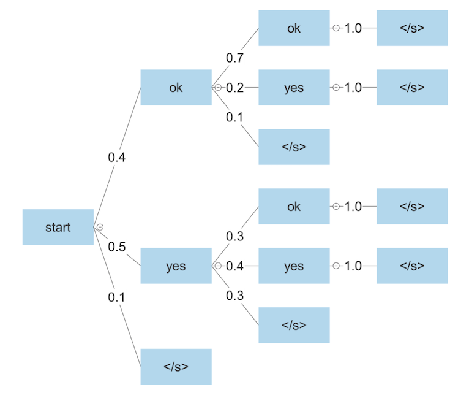
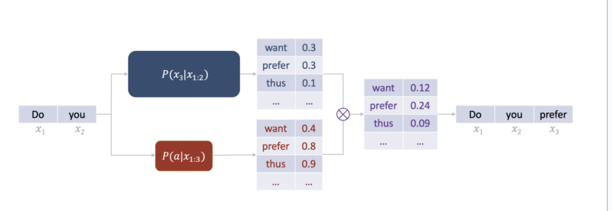

# Inference
- **Greedy Decoding**: Taking the most probable token from the the distribution
  - An issue with this approach is that it ignores the long-tail of the model's distribution, and thus can lead to generic outputs
- **Ancestral Sampling**: Samples from the probability distribution
  - However, this can result in very improbable sequences being generated
  - One variation might be truncating the sampling from the top $k$ most probable tokens
  - Another variation might take the top $p$ of the probability mass (as opposed to a set number of tokens)
    - This works in cases where the probability mass is more uniformly distributed rather than tail heavy
- **Distribution Temperature**: Rescaling the probability distribution - bringing values closer together or further apart
  - The temperature parameter $T$ scales the logits: $\frac{\exp(z_i / T)}{\sum_j \exp (z_j/T)}$
  - Higher temperature values result in more diversity (since we are boosting up low probabilities), whereas lower temperatures result in less diversity (since we are boosting up higher probabilities)
- One issue with sampling-based approaches is that we make the selection decision at the *current time step*, but do not consider *future time steps* and their selections
  - A "good" token selection at timestep $t$ will not always necessarily lead to a "good" token selection at timestep $t+1$, $t+2$, etc.
  - This leads to **beam search**, where sequences are explored before making a decision about which one to keep
    - 
    - The search is done until reaching a fixed depth or achieving a fixed number of sequences
      - Smaller beam sizes allow for faster decoding and less memory, but there is more search error 
      - Larger beam sizes are slower but closer to finding the true highest-score output
        - However, a higher beam size does not always translate to a larger downstream task performance
    - The probabilities of a sequence are computed in log space (add everything together) and also are normalized by the length of the sequence (for fair comparisons of the paths based on lengths instead of being biased towards short sequences)
    - Formal:
      - Set a beam width $k$
      - Start: Choose the top-k highest probability tokens to start the beams
      - Expand: Choose the top-k highest probability continuations for each ($k^2$ options)
      - Prune: Cut down to the $k$ highest scoring continuations according to a scoring functio ($\log$ probability)
    - There are many variations on the beam search algorithm to try to increase the diversity in the beams
      - Encouraging diversity in the probabilities:
      - **Hamming Diversity**: Penalize a token proportional to the number of times it has occurred before in active beams
        - **Cumulative Diversity**: Penalize using identical tokens at the same timestep
        - **Embedding Diversity**: Penalize any exact n-gram matches
        - **Embedding Diversity**: Penalize tokens with similar embeddings (accounts for synonyms)
      - **Stochastic Beam Search**: Add noise to teh selection process, using a Gumbel Distribution, which is to model for sample extremes
        - Given a collection of random variables, the 
## Advanced Inference Methods
- **Constrained decoding**: Train a lightweight estimator of how likely it is an output fits a given constraint (e.g. output style requirements)
  - $P(x_i | x_{1:i-1, a}) \propto P(a|x_{1:i})P(x_i | x_{1:i-1})$ where $a$ is the constraint
  - 
- **Contrastive decoding**: Use two models: choose outputs that the "expert" finds much more likely than the "amateur" 
  - 
- **Self-correcting decoding**: Have the model get feedback on its own output, and then refine the output based on its feedback (initial generation and then critique)
# Test Time Scaling
- Rather than allocate more compute during the *training* of the model, we can instead allocate this compute during *inference*
- This can involve generating additional tokens to explain step-by-step process of problem solving - **chain of thought**