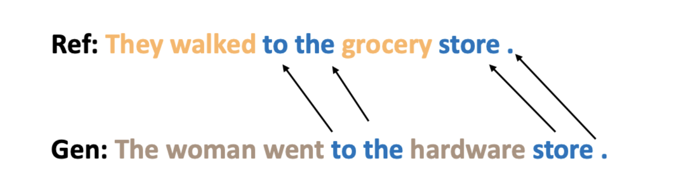
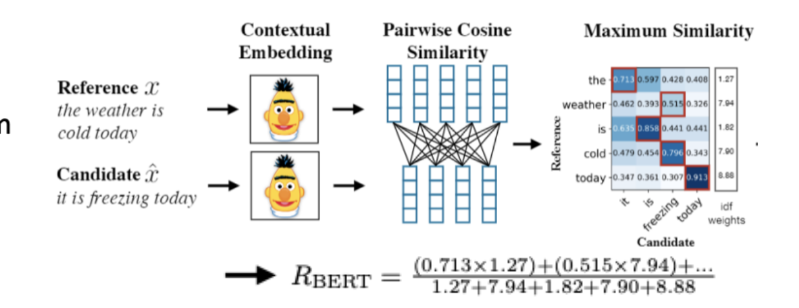
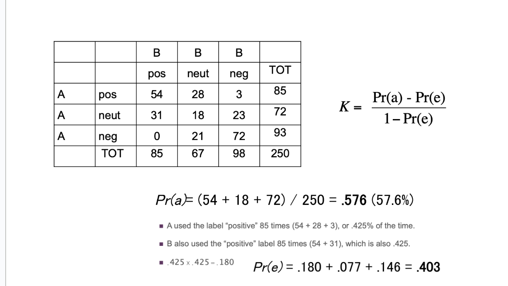

# Model Evaluation
- Some common metrics in statistics:
  - Accuracy: $\frac{\text{correct classifications}}{\text{total  classifications}} = \frac{TP+TN}{TP+TN+FP+FN}$
  - Precision: $\frac{\text{correctly classified actual positives}}{\text{everything classified as positive}} = \frac{TP}{TP +FP}$
  - Recall: $\frac{\text{correctly classified actual positives}}{\text{all actual positives}} = \frac{TP}{TP + FN}$
  - F1: $\frac{2 \times \text{precision} \times \text{recall}}{\text{precision} + \text{recall}}$
- Evaluation *with a reference*:
  - **N-Gram Based Metrics**: Compute score indicating lexical similarity between generated and gold standard text
    - Typically involves determining overlap
      - 
    - Used typically for translation and summarization - e.g. BLEU, ROGUE, METEOR, etc.
    - A major issue with this is that there is a lack of *semantic understanding*
  - **Model-Based Metrics**: 
    - **BERTSCORE**: Use pre-trained contextual embeddings from BERT and match words in candidate and reference text by cosine similarity
      - 
    - **BLEURT**: Regression model based on BERT that returns a score indicating to what extent the candidate text is grammatical and conveys the meaning of the reference text   
- Evaluation *without a reference*:
  - **LLM-as-a-Judge**: Model gives a score indicating which two responses it prefers
    - Careful of *self-bias* - LLMs tend to give higher scores to responses generated by models from their same family
  - **Human Evaluation** (Gold Standard): Ask humans to evaluate quality of generated text, along a given rubric 
    - For training: Typically hire annotators like those from *Amazon Mechanical Turk* - e.g. choose more helpful and honest response among two generated ones
    - For evaluation: Use task benchmarks (e.g. BIG-bench)
- To ensure quality in human evaluation, it is necessary to determine if annotators make *consistent judgements* - if they do not, it could be a sign of annotator error or bad protocol design
  - Can measure raw percentage agreement between two annotators
  - **Cohen's Kappa (K)**: Measures agreement between two annotators, taking into account possibilities of chance agreement
    - $K = \frac{Pr(a) - Pr(e)}{1 - Pr(e)}$
      - $Pr(a)$ is actual agreement
      - $Pr(e)$ is expected agreement
    - Example:
      - 
      - $K = \frac{0.576 - 0.403}{1 - 0.403} = 0.29$
    - Scores can vary, but typically above 0.8 indicates a good annotating result
- Other issues with annotators:
  - Order bias
    - Must address by randomizing order of questions and answers
  - Inattentive annotators
    - Address by putting simple attention checks in annotation software
  - AI annotators: More and more crowd workers are using LLMs to complete a summarization task
  - Variability among evaluators 
- Benchmarks should have some minimum reporting requirements:
  - Indicate who the participants are and some relevant information (primary language, expertise, etc.)
  - Indicate how the participants were prepared (given instructions or shown examples, etc.)
  - Indicate how the task was constructed
  - Indicate how the annotations look like
- Benchmarking Ecosystem:
  - Dynamic benchmarking:
    - e.g. Have an evaluator interact with a live system - e.g. *edit* a response
    - e.g. Have an evaluator chat with two (anonymized) models and vote for the better one - can use an ELO system
      - Downside to this is that there is not as much of an intuition as to *why* one system is better than the other
- **Benchmark Contamination**: Training data may contain benchmarks, resulting scores on such benchmarks being too high
  - Can try to keep private test sets
  - Can try to create *dynamic* test sets (constantly change inputs)