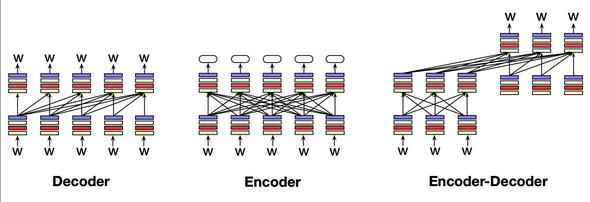

# Large Language Models
- Large language models can learn a considerable amount of knowledge regarding language, context, and the world, simply by ingesting a large corpus of text - a process known as **pretraining**
  - Recall that language models can be used to generate text (next word) by **sampling** from a distribution of next words
  - **Autoregressive (causal)** models iteratively generate words left-to-right by getting a context, generating a new token, adding that token to the new context, and repeating the process
## Three Architectures for Language Models
- **Decoders** take as input a series of tokens and iteratively generate an output token at a time
  - Common decoders are GPT, Claude, Llama, and Mistral
  - Information in decoders flow from left-to-right, and they are only able to make use of *prior words*
- **Encoders** take as input a series of tokens and output *vector representations for each token*
  - Common encoders are in the BERT family
  - Encoders are usually *masked language models*, meaning they are trained to mask out a word and then predict it by looking at context from *both sides*
  - Encoders are not typically used for text generation but rather for classifiers (e.g. sentiment)
- **Encoder-Decoders** take as input a series of tokens and output a series of tokens, often with the caveat that the input and output series of tokens have some sort of difference (e.g. a different language)
- 
## Conditional Generation of Text
- **Conditional generation** involves providing an LLM a relevant **prompt** in order to achieve a certain language-related task
  - e.g. Sentiment Analysis:
    - Given: `The sentiment of the sentence 'I like Jackie Chan' is`
    - Sentiment can be determined by simply comparing the probability of the next word being `positive` versus the probability of the next word being `negative`
  - e.g. Question Answering:
    - Given: `Q: Who wrote the book 'The Origin of Species'? A: `
    - Answer can be determined via the next generated tokens
## Prompting
- Language models can be specifically trained to follow instructions via **instruction tuning**, which involves training a large language model on a special dataset of instructions together with appropriate responses to each
- With instruction tune models, it is easier to **prompt** models 
- Efficient prompts are those that provide some labeled *examples* in the prompt, known as **demonstrations**
  - Providing *no demonstrations* is known as **zero-shot** prompting, while providing a few demonstrations is known as **few-shot prompting**
  - Demonstrations provide models a better understanding of the task and the format of the output
  - Prompts can be viewed as a **learning signal** without necessarily doing any sort of backpropagation - this is **in-context learning**
- Many large language models utilize a **system prompt**, often which is silently prepended to any user queries
## Generation and Sampling
- **Greedy decoding** involves generating the most likely token in a given context, but this is often not effective in practice because it can result in very predictable, generic outputs
- **Random sampling** instead involves sampling from the probability distribution according to their likelihood, but this too can result often in gibberish due to the odds of the tail (rare) tokens being occassionally chosen
- **Temperature sampling** tries to balance the two by reshaping the probability distribution to increase the likelihood of high probability tokens and decrease the likelihood of low probability tokens
  - This is done by dividing the logits by the temperature parametr $\tau$
  - $\bold{y} = \text{softmax}(\bold{u} / \tau)$
  - $0 < \tau $ is the temperature, where if it is larger then we are closer to random sampling and otherwise if it is smaller we are closer to greedy sampling
    - Intuitively, dividing by a small number will increase the value, and so larger values will be pushed towards higher probabilities when passed through the softmax
## Training Large Language Models
- The first stage of training a large language model is **pretraining**, where the model is trained to predict the next word on a large text corpora, often using cross-entropy loss
  - This results in a model that is very good at predicting words and generating new text
  - The training is done in a **self-supervised** fashion since the next word in the corpus acts as a label
    - Since the correct distribution is just a one-hot vector where the actual correct word is 1 and all other entries are zero, the loss can be simplified:
      - $L_{CE}(\hat{y}_t, y_t) = - \sum_{w \in V} y_t[w] \log\hat{y}_t[w] = -\log\hat{y}_t[w_{t+1}]$
    -  When training, even if the model does not predict the correct next word, it should continue as if it did (adding the *correct token to the context*) as to stabilize training - this is known as **teacher forcing**
  - The corpora used to trean is often text scraped from the web and augmented to be a bit more curated
    - Data may be taken from **common crawl** or **The Pile**
    - It is important to filter the data for quality and safety - such as by using only high-quality references (e.g. Wikipedia), removing boilerplate text, filtering out toxicitiy, and so on
- The next stage involves **instruction tuning** (aka **supervised fine tuning**) where the model is again trained (via cross-entropy) to follow instructions, typically on a special corpus of instruction/response data
- The last stage is **alignment**, where the model is trained to be maximally helpful and less harmful. This may involve providing the model preference data, which involves a context followed by two potential continuations that are labeled by humans as either 'accepted' or 'rejected', and using reinforcement learning to produce the accepted continuation and not the rejected continuation
## Finetuning
- A model can be continued to be trained on information relevant to a new domain via the **finetuning** process
  - One method of doing so is just continuing to train, as if the new data was at the end of the pretraining data - this is known as **continued pretraining**
## Evaluating Large Language Models
- One metric for evaluating language models is determining the probability (log) of a text being predicted by a language model  
  - $\log \prod_{i = 1}^n P(w_i | w_{< i})$
  - This metric, however, depends on the number of tokens in the text, and so it is useful to normalize by length - this results in a metric known as the **perplexity**
    - $\text{Perplexity}_\theta (w_{1:n}) = P_{\theta}(w_{1:n})^{-\frac{1}{n}} = \sqrt[n]{\prod_{i=1}^n \frac{1}{P_{\theta}(w_i | w_{< i})}}$
    - Since the probability is an inverse here, the *higher the probability of the word sequence, the lower the perplexity* - and so a lower perplexity usually indicates a better model
    - Perplexity is sensitive to the differences in the tokenization algorithm, so it should be used for models that use the same tokenizer
- Another way to evaluate language models is on their effectiveness in downstream tasks, such as question answering
  - One common question answering dataset is the Massive Multitask Language Understanding (**MMLU**) dataset, which is often used as a proxy for a model's ability to reason
    - Be careful not to **contaminate** the training data with information already from the MMLU if it is used as an evaluation metric
## Ethical and Safety Issues
- Language models may **hallucinate**, which means they can generate incorrect content
  - This can be mitigated partly via **retrieval augmented generation**
- Language models can also be very **sycophantic**, meaning they excessively agree with users - this may not be ideal in many cases
- An important ethical consideration with language models is to try to provide **datasheets** and **model cards** that provide full information on the corpora used to train models