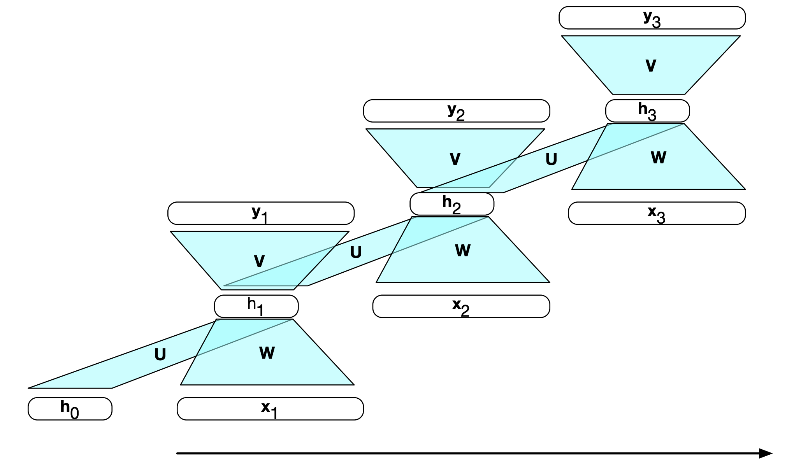
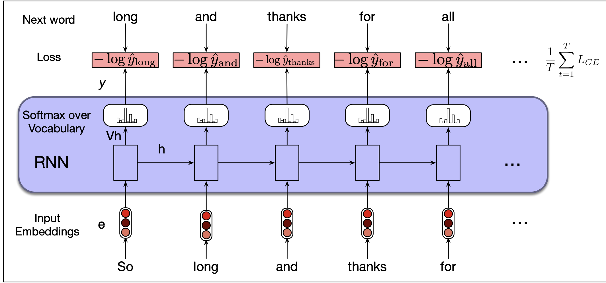
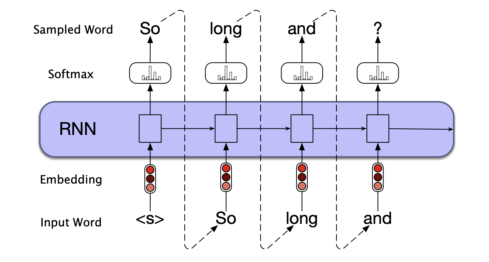
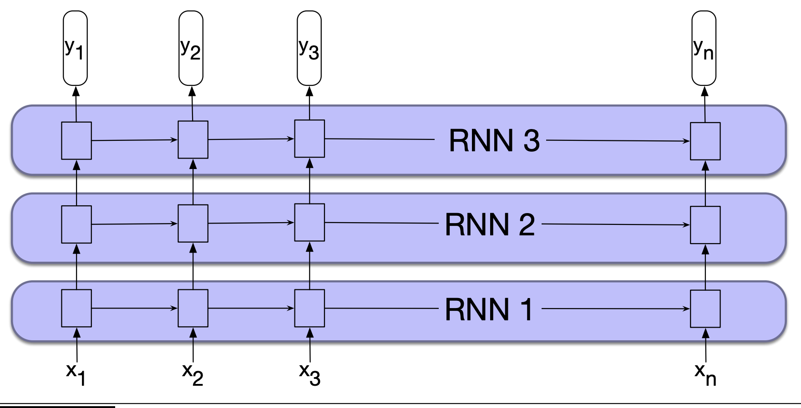
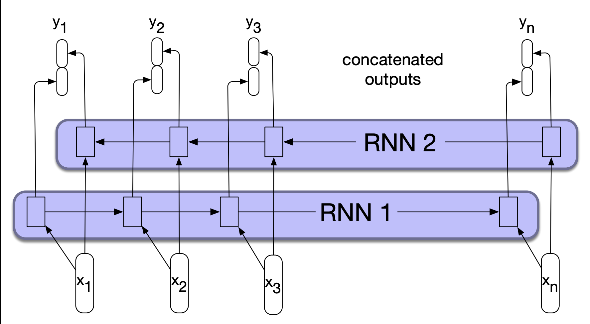
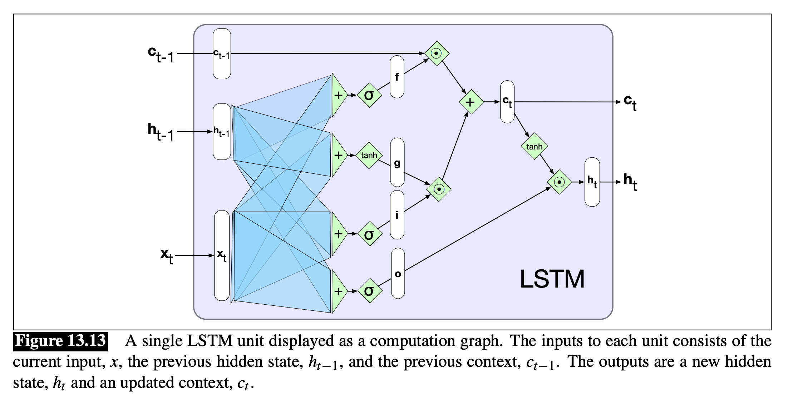
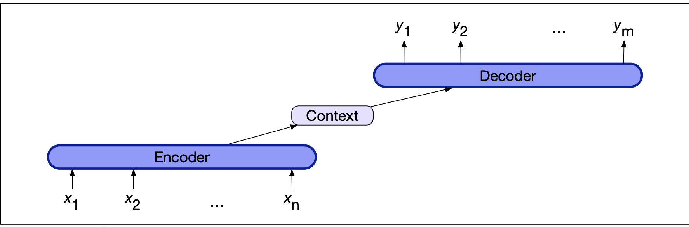
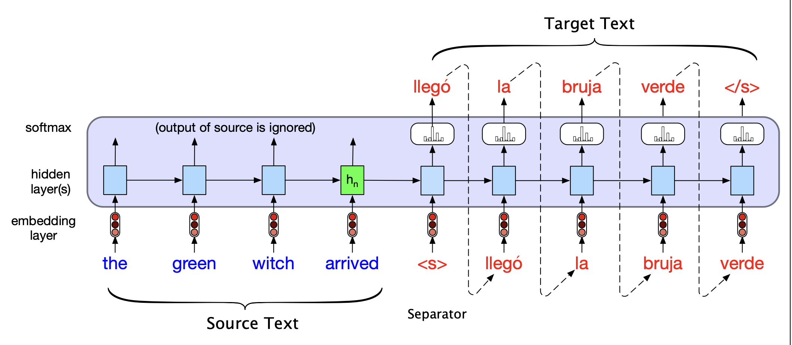
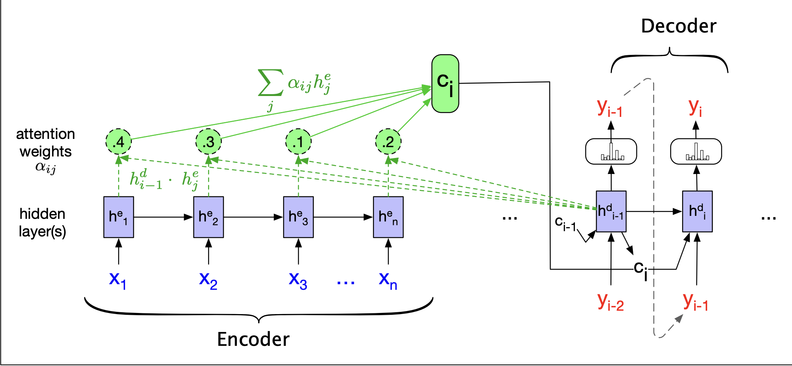

# RNNs and LSTMs
## Recurrent Neural Networks
- **Recurrent neural networks** have cycles in their network connections, meaning that the value of some unit is dependent on *earlier outputs* as input
  - This provides a form of memory (or  context) that encodes earlier processing and informs the decisions to be made at later points in time
  - There is no fixed-length limit on these networks (though they may have difficulty incorporating very far back information)
### Inference in RNNs
- Formulas:
  - $\bold{h_t} = g(\bold{U}\bold{h_{t-1}} + \bold{W}\bold{x_t})$
  - $\bold{y_t} = f(\bold{V}\bold{h_t})$
- Forward inference must be done *sequentially* due to the usage of the previous value in the hidden layer for computation
  -     function ForwardRNN(x, network) returns output sequence y
          h[0] = 0
          for i = 1 to Length(x) do
            h[i] = g(U*h[i-1] + W * x[i])
            y[i] = f(V*h[i])
          return y
- 
### Training
- RNNs require **backpropagation through time**, where in the first pass a forward computation gathers $\bold{h_t}, \bold{y_t}$, accumulates the loss at each step in time, and saves the value of the hidden layer at each step for use. The second pass then processes the sequence in reverse, computing the required gradients as it goes
- Most modern computational frameworks can train RNNs directly by explicitly unrolling the network into a feedforward computational graph
## RNNs as Language Models
- Given an input sequence (preceding context), language models are able to assign a conditional probability to every possible next word
- RNN lanaguage models process the input sequence one word at a time, and predict the next word from the current word and the previous hidden state
### Forward Inference
- Given an input sequence $\bold{X} = [\bold{x}_1 ; ... ; \bold{x_t}; ...; \bold{x}_N]$, which are one-hot vectors of size $|V| \times 1$, forward inference with an RNN yields an output probability distribution (over a vocabulary) $\bold{\hat{y}}$ by first emebedding the input, then multiplying with the weight matrix and adding it to the hidden layer from the previous step:
  - $\bold{e_t} = \bold{E}\bold{x_t}$
  - $\bold{h_t} = g(\bold{Uh_{t-1}} + \bold{We_t})$
  - $\bold{\hat{y}}_t = \text{softmax}(\bold{Vh_t})$
    - The probability that a particular word $k$ in the vocabulary is the next word is just $\bold{\hat{y}}_t[k]$
### Training
- Training can be done in a **self-supervised** fashion
- Take a corpus of text as training material and at each time step $t$ prompt the model to predict the next word, and find the cross-entropy loss between the predicted probability distribution and the correct word
  - $L_{CE}(\hat{y}_t, y_t) = - \sum_{w \in V} y_t[w] \log\hat{y}_t[w] = \log\hat{y}_t[w_{t+1}]$
    - Since the true distribution is just a one-hot vector (so the correct entry is 1 and all other entries are 0)
- When moving on to thee next word, ignore what the model predicted for the next word and instead use the correct word $w_{t+1}$ along with the prior history to estimate the probability of token $w_{t+2}$ - this is known as **teacher forcing**
- 
### Weight Tying
- In practice, there is no need for the weights $V$, which acts as a second learned set of word embeddings (used for *unembedding*) - rather, the language model can just learn $E$ and transpose it at the end to unembed 
  - This is known as **weight tying**, and reduces the number of parameters required for the model
  - $e_t = Ex_t$
  - $h_t = g(Uh_{t-1} + We_t)$
  - $\hat{y}_t = \text{softmax}(E^Th_t)$
## RNNs for Other NLP Tasks
- **Sequence Labeling**: Assign a label chosen from a small fixed set of labels to each element of a sequence (e.g. part-of-speech tagging)
  - With an RNN, use the output of the network at *each time step* to represent the distribution over the tag set, as generated by a softmax layer
  - train with cross-entropy loss during training
- **Sequence Classification**: Classify entire sequences rather than the tokens within them (e.g. text classification, like with sentiment analysis)
  - Pass the text to be classified through the RNN, but take the *last hidden layer* to constitute a compressed representation of the entire sequence, and pass it through a feedforward network to choose a class via softmax
  - Train with cross entropy loss - note that the error signal will be backpropagated all the way through the feedforward classifier to the RNN (**end-to-end training**)
  - Alternatively could use all hidden states and **pool** them via some function (like a mean or element-wise max)
- **Generation**: First, randomly sample a word to begin a sequence based on its suitability at the start of a sequence (e.g. a `<START>` tag), pass this through the RNN to get a new a word, and then use this new word as the input to generate a *new word*
  - This is known as **autoregressive generation**
  - 
## Stacked and Bidirectional RNN Architectures
### Stacked RNNs
- **Stacked RNNs** use the sequence of outputs from one RNN as input to another one - allowing for *multiple layers*
  - This can do better than single-layer networks, but obviously is more expensive
- 
### Bidirectional RNNs
- Normally, RNNs use information from left-to-right, but in cases where we want to use context to the *right* of the current sequence it is necessary to use a **bidirectional RNN**
- These involve running two separate RNNs, one left-to-right and another right-to-left, and concatenating their representations
  - $h_t = [h_t^f ; h_t^b]$
- 
## LSTMs
- In practice, RNNs tend to encode more local information in their hidden states as compared to distant - yet this distant information is often critical to language applications
  - e.g. "The **flights** the airline was canelling **were** full."
- Another issue with RNNs is that they suffer from vanishing gradients 
- The **long short-term memory (LSTM)** network divide context management into two subproblems: removing information no longer needed from the context, and adding information likely needed for later decision making - this is all done through the usage of *gates*
  - These gates involve a feedforward layer, followed by a sigmoid activation function (to push outputs to either 0 or 1), followed by a pointwise multiplication with the layer being gated (like a binary mask)
- **Forget Gate**: Delete information from the context that is no longer needed
  - $f_t = \sigma(U_f h_{t-1} + W_f x_t)$
    - Weighted sum of previous state's hidden layer and current input
  - $k_t = c_{t-1} \odot f_t$
    - Selectively remove information from teh context that is no longer required
- **Add Gate**: Add new information
  - $g_t = \tanh(U_gh_{t-2} + W_g x_t)$
    - Extract information from previous hidden state and current inputs
  - $i_t = \sigma(U_i h_{t-1} + W_i x_t)$
    - Add gate to select information to add to the current context
  - $j_t = g_t \odot i_t$
- Add modified context vector to get new context vector
  - $c_t = j_t + k_t$
- **Output Gate**: Decide which information is required for the current hidden state (as opposed to what information needs to preserved for future decisions)
  - $o_t = \sigma(U_oh_{t-1} +W_o x_t)$
  - $h_t = o_t \odot \tanh(c_t)$
- 
## Encoder-Decoder Model
- The **encoder-decoder** (aka **sequence-to-sqeuence**) model is useful for taking an input sequence and translating it to an output sequence that is of different length than the input, and does not necessarily align with it in a word-to-word way
  - The **encoder** takes an input and creates a contextualized representation of it
  - The **decoder** then generates a task specific output sequence
- With RNNs, the final hidden state of the input (prefix) is used as the *context* for the decoder
- 
- An autoregressive language model can be easily transformed into an encoder-decoder by simply adding a **sentence separation** marker at the end of the source text, and then concatenate the target text
  - 
  - The context vector $c$, which is the last encoder hidden state, could naively but used as just the first hidden state of the decoder; alternatively, this context vector could be available to more than just the first decoder hidden state to ensure that its influence does not wane over the sequence
    - $c = h_n^e$
    - $h_0^d = c$
    - $h_t^d = g(\hat{y}_{t-1}, h_{t-1}^d, c)$
    - $\hat{h}_t = \text{softmax}(h_t^d)$
  - This can be trained using standard datasets of aligned sentence pairs, and then utilize teacher forcing as usual
## Attention
- With the aforementioned encoder-decoder model, there is an issue with the final hidden state of the encoder acting as a **bottleneck** - it must represent absolutely *everything* about the meaning of the source text since it is the only thing the decoder uses
- The **attention mechanism** acts as a solution to this bottleneck problem, enabling the decoder to get information from *all* hidden states of the encoder (not just the last one)
- With attention, the context vector is not taken from the last hidden state but instead is a *weighted average* of all hidden states of the encoder - this weighted average is dynamically informed by the decoder state (right before the current token $i$)
- The attention context $c_i$ is computed by determining how relevant each encoder state is to the decoder state captured in $h_{i-1}^d$
  - A simple such score is the **dot-product attention**: $\text{score}(h_{i-1}^d, h_j^e) = h_{i-1}^d \cdot h_j^e$
  - Normalize the scores with a softmax to create a vector of weights that indicate the proportional relevance of each encoder hidden state $j$ to the prior hidden decoder state ($i$)
    - $\alpha_{ij} = \text{softmax}(\text{score}(h_{i-1}^d, h_j^e))$
  - Compute the context vector: $c_i = \sum_j \alpha_{ij} h_j^e$
  - Use this context vector for computing the new hidden state: $h_i^d = g(\hat{y}_{i-1}, h_{i-1}^d, c_i)$
  - 