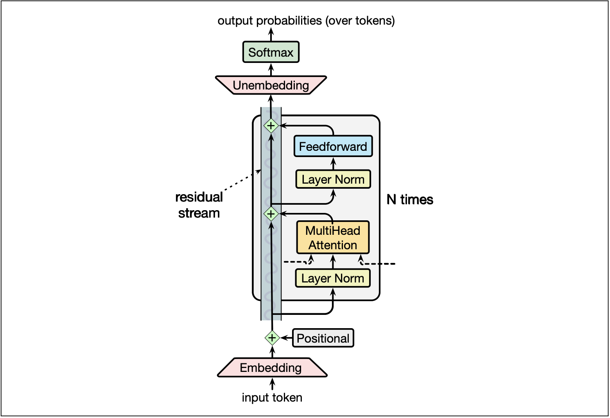
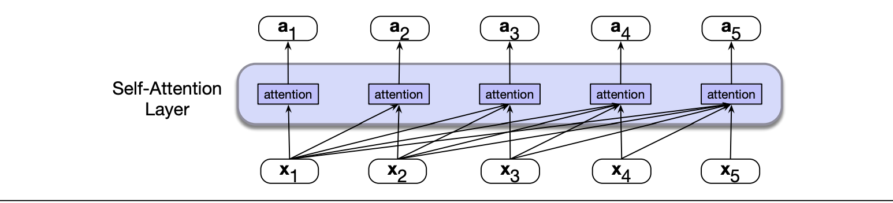
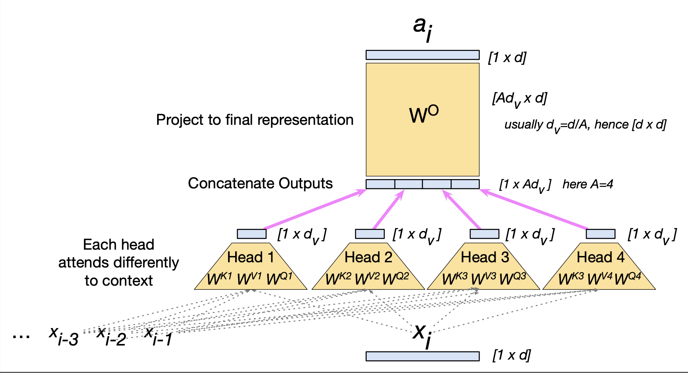
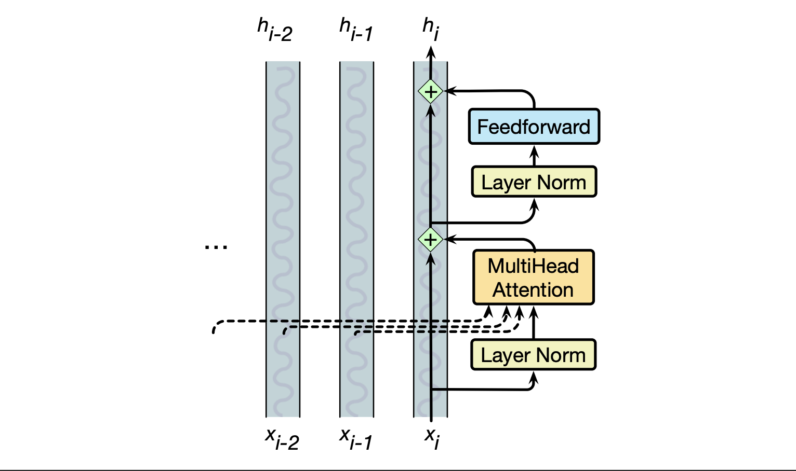
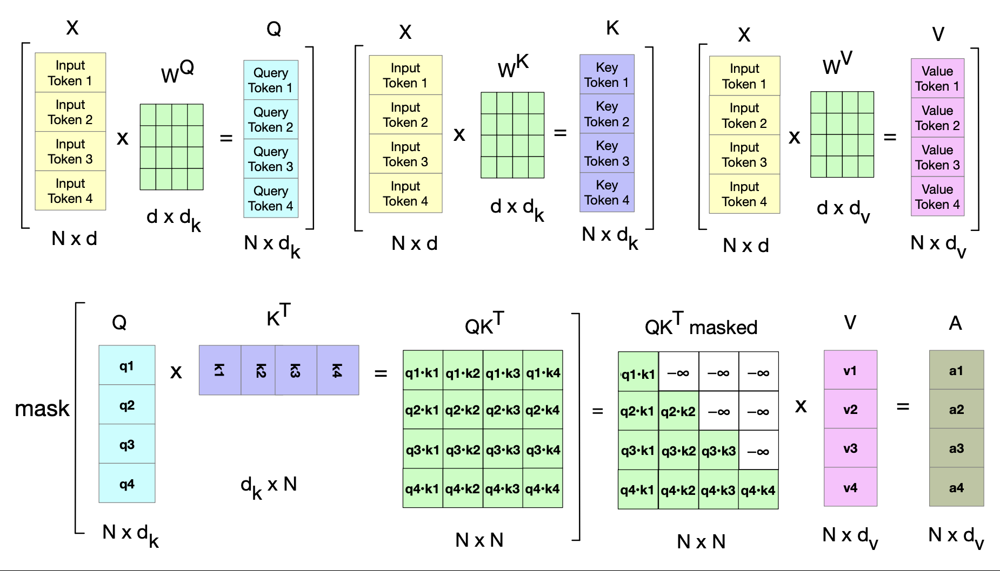
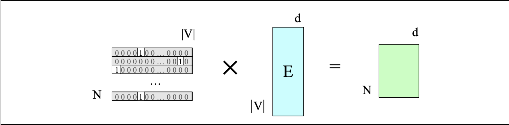
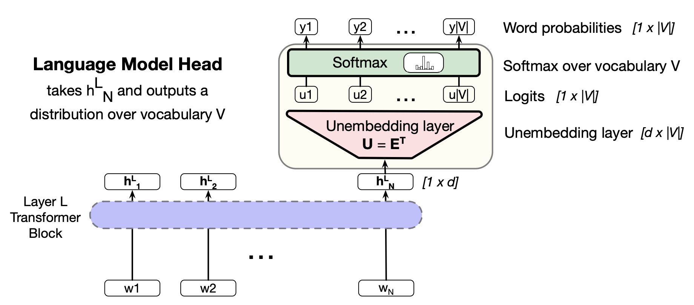
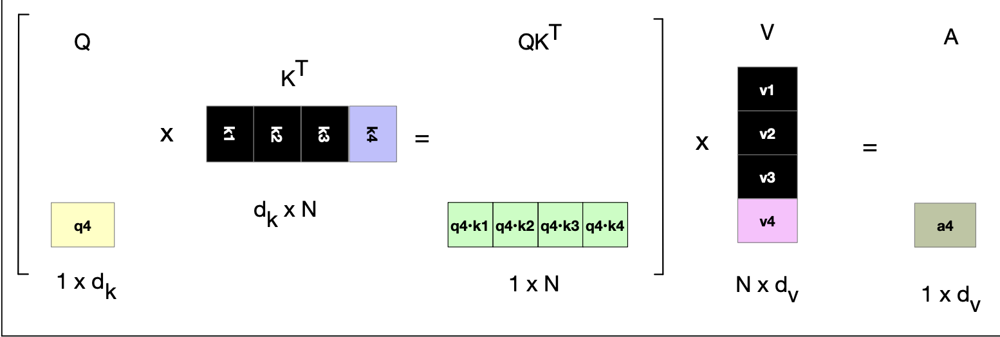

# Transformers
- 
  - First, each token is turned into an initial embedding via an **embedding matrix**, and also a positional embedding is added to this representation
  - In each transformer block, the embedding is directly passed up to the output while being modified by other modules, such as the **multi-head attention** layer, feedforward networks, and layer normalization
    - **Self-attention** builds a contextual representation of the token's meaning by integrating information from surrounding tokens
  - Finally, the output from the final transformer block is passed through an **unembedding matrix** and then through softmax to get a distribution over the next possible token
## Attention
- The point of attention is that *static embeddings*, like those generated by word2vec, are not enough to represent hte complete meaning of words in context - rather, **contextual embeddings** are necessary
- Each layer of the tranasformer builds up richer and richer contextual embeddings by leveraging the **attention** mechanism
  - 
- Attention takes an input representation $x_i$ corresponding to the token at position $i$ and a context window of prior inputs $x_1, ..., x_{i-1}$ and produces an output $a_i$
- In a *naive version* of attention, all that is really necessary is to represent $a_i$ as a weighted sum of the context vector, and these weights can be found via dot product similarity
  - $a_i = \sum_{j \leq i} \alpha_{ij}x_j$
  - $\text{score}(x_i, x_j) = x_i \cdot x_j$
  - $\alpha_{ij} = \text{softmax}(\text{score}(x_i, x_j)) \ \forall j\leq i$
- The *actual version* of attention is a bit more complex, but uses the same foundation
  - It separates the input embeddings into three different concepts:
    - **Query**: The current element being compared to preceding inputs
      - $q_i = x_i W^Q$
    - **Key**: The preceding element compared to the current element
      - $k_i = x_i W^K$
    - **Value**: The value of the preceding element that gets weighed and summed
      - $v_i = x_i W^v$
    - The similarity is found by taking the dot product between the query and key, though one caveat is that this dot product must be scaled by the dimensionality of the query/key (both have the same dimensions) to avoid arbitrarily large values
      - $\text{score}(x_i, x_j)= \frac{q_i \cdot k_j}{\sqrt{d_k}}$
      - $\alpha_{ij} = \text{softmax}(\text{score}(x_i, x_j)) \ \forall j \leq i$
      - $\text{head}_i = \sum_{j \leq i} \alpha_{ij} v_j$
      - $a_i = \text{head}_i W^O$
        - $W^O$ is necessary to reshape the output of the head 
    - Shapes:
      - Input is $1 \times d$
      - Query and Key are $1 \times d_k$
        - $W_Q$ and $W_K$ are $d \times d_k$
      - Value is $1 \times d_v$
        - $W_V$ is $d \times d_v$
      - $\text{head}_i$ is $1 \times d_v$
      - $W_O$ is $d_v \times d$
- Transformers can use **multiple attention heads**, with the intuition that each head attends to the context for different linguistic purposes
  - There are $A$ separate attention heads that reside *in parallel* layers at the same depth in a model, each with its own set of parameters
  - Thus, each head $i$ has parameters $W^{Qi}$, $W^{Ki}$, and $W^{Vi}$
  - Mathematical:
    - $q_i^c = x_i W^{Qc}$ ; $k_j^c = x_j W^{Kc}$ ; $v_j^c = x_j W^{Vc}$ ; $\forall c \ 1 \leq c \leq A$
    - $\text{score}^c(x_i, x_j) = \frac{q_i^c \cdot k^c_j}{\sqrt{d_k}}$
    - $\alpha^c_{ij} = \text{softmax}(\text{score}^c (x_i, x_j)) \ \forall j \leq i$
    - $\text{head}_i^c = \sum_{j \leq i} \alpha_{ij}^c v_j^c$
    - $a_i = (\text{head}^1 ; \text{head}^2 ; ... ;\text{head}^A)W^O$
  - 
## Transformer Blocks
- Interpret the transformer block as a *residual stream*, where the various components read the original input from the stream and add their own output back to the stream (via residual connections) - these other components are the attention layer and the feedforward layer
  - 
- The **feedforward layer** is just a fully connected 2-layer network: $\text{FFN}(x_i) = \text{ReLU}(x_i W_1 + b_1)W_2 + b_2$
- **Layer norm** involves normalizing the *embedding vector* over its elements:
  - $\mu = \frac{1}{d} \sum_{i=1}^d x_i$
  - $\sigma = \sqrt{\frac{1}{d} \sum_{i=1}^d (x_i - \mu)^2}$
  - $\hat{x} = \frac{(x - \mu)}{\sigma}$
  - $\text{LayerNorm(x)} = \gamma \frac{(x - \mu)}{\sigma} + \beta$
- Full Block (One Token at a Time):
  - $t_i^1 = LayerNorm(x_i)$
  - $t_i^2 = \text{MultiHeadAttention}(t_i^1, [t_1^1, ..., t^1_N])$
  - $t_i^3 = t_i^2 + x_i$
  - $t_i^4 = \text{LayerNorm}(t_i^3)$
  - $t_i^5 = \text{FFN}(t_i^4)$
  - $h_i = t_i^5 + t_i^3$
## Parallelizing Computation
- The attention computation fo reach token is independent of the computation for each other token, and so there is room to easily parallelize the entire computation for the whole sequence of input tokens, which are packed into a single matrix $X$ of size $[N \times d]$
- Math:
  - $Q = XW^Q$ ; $K = XW^K$ ; $V = XW^V$
    - Shapes respectively are: $[N \times d_k]$, $[N \times d_k]$, $[N \times d_v]$
  - Similarity Matrix: $QK^T$, of shape $[N \times N]$
    - 
  - $\text{head} = \text{softmax}(\text{mask}(\frac{QK^T}{\sqrt{d_k}}))V$
    - The mask sets $M_{ij} = - \infty \ \forall j > i$ so that the softmax becomes zero
  - $A = \text{head} W^O$
- 
- Multi-head attention can become parallelized in a similar manner:
  - $Q^i = XW^{Qi}$ ; $K^i = XW^{Ki}$ ; $V^i = XW^{Vi}$ 
  - $\text{head}_i = \text{SelfAttention}(Q^i, K^i, V^i) = \text{softmax}(\text{mask}(\frac{Q^i K^{iT}}{\sqrt{d_k}}))V^i$
  - $\text{MultiHeadAttention}(X) = (\text{head}_1 ; \text{head}_2 ; ... ; \text{head}_A)W^O$
## Embeddings for Token and Position
- Given $N$ tokens, there is first a token embedding that is the *initial representation of the input token*
  - These embeddings are stored in the embedding matrix $E$, which has shape $[|V| \times d]$
  - Tokens are first converted into vocabulary indices and then indexed based on the corresponding row in $E$
    - e.g. "Thanks for all the" tokenizes into [5, 4000, 10532, 2224], and then indexing is used to select the corresponding row 5, row 4000, row 10532, and row 2224 from $E$
    - In practice, the tokenizer converts the tokens into **one-hot vectors**, and this can be multiplied by $E$ to select out the corresponding hot row
  - 
- The initial token embeddings are not position-dependent, so they need **positional embeddings** added to them
  - In practice, this is done via sinusoidal position embeddings
## The Language Modeling Head
- The **language modeling head** takes the final transformer output to predict the next word, doing so by first unembedding the input by multiplying by the transpose of the embedding matrix $E^T$
  - Since there is **weight tying**, $E$ will learn to be good at both embedding *and* unembedding
- The softmax layer then turns the unembedded logits into probabilities over the vocabulary, which can be **sampled** to generate text (such as by greedily choosing the word with highest probability)
- 
## Sampling
- **Tok-k sampling** generalizes greedy decoding by truncating the  distribution to the *top k* most likely words, renormalizing to produce a legitimate probability distribution, and finally randomly sampling from these $k$ words according to their renormalized probabilities
- **Top-p (nucleus) sampling** keeps the *top p percent* of the probability mass and samples based on that - the hope here is to be more robust in different contexts (this can dynamically increase or decrease the pool of word candidates)
## Scale
- Large language models can scale with *model size*, *dataset size*, and *compute used for training* - these are the **scaling laws**
- Given loss $L$, number of non-embedding parameters $N$, dataset size $D$, and compute budget $C$, it was shown that:
  - $L(N) = (\frac{N_c}{N})^{\alpha_N}$
  - $L(D) = (\frac{D_c}{D})^{\alpha_D}$
  - $L(C) = (\frac{C_c}{C})^{\alpha_C}$
- During inference, attention cannot be so easily computed in parallel because we are generating tokens *one at a time*
  - For each token, $x_i$, its query, key, and values need to be generated
  - However, there is no need to recompute the key and value vectors for all *prior* tokens - they can instead be storedi n the **KV cache** and grabbed when needed
  - 
- It is common to take a large language model and **finetune** it on some additional data, but this can be difficult for very large models due to the sheer number of parameters
  - **Parameter-efficient fine tuning (PEFT)** can be used to fine tune models without changing *all parameters*, but rather just a subset of parameters (while freezing the rest)
  - **Low Rank Adaptation (LoRA)**: Given a matrix $W$, freeze $W$ and instead train a low-rank decomposition of $W$ during gradient descent
    - If W is $[k \times d]$, create two matrices $A$ and $B$ of respective sizes $[k \times r]$ and $[r \times d]$, where $r << \min(d, k)$
    - During fine-tuning, $A$ and $B$ are updated instaed of $W$ - so instead of $W + \Delta W$, it is $W + AB$
      - This means the forward pass $h=xW$ is instaed $h = xW + xAB$
    - During training, the gradient now does not need to be calculated for most parameters (just $A$ and $B$), and during inference $W$ can be updated directly by just adding $AB$